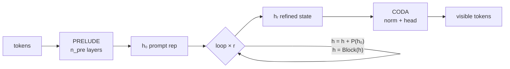

<!-- SPDX-License-Identifier: LicenseRef-NON-AI-MPL-2.0 -->
<!-- Copyright (C) 2026 SnapKitty Collective -->
# Astra: recurrent depth + latent reasoning

A looped-transformer reference architecture. Instead of stacking dozens of
uniquely parameterized layers, **one shared Transformer block is looped `r`
times** over the evolving hidden state — depth as compute, not parameters.
Reasoning happens silently in latent space: no intermediate tokens.

```
tokens → [PRELUDE] → h₀ → [SHARED BLOCK × r, h₀ re-injected] → [CODA] → tokens
```

## Layout

| Path | Layer | Status |
|---|---|---|
| `pytorch/astra/` | Research: `LoopedTransformer` (prelude → loop → coda), latent-loop monitors, synthetic tasks | ✅ executed (CPU) |
| `pytorch/train.py` | Depth-beats-parameters demo | ✅ executed (CPU) |
| `pytorch/tests/` | 12 unit tests | ✅ 12/12 pass |
| `cuda/` | Fused inject+norm kernel, ring KV cache | ⚠️ written, not compiled (no GPU here) |
| `rust/astra-serve/` | Batching scheduler, adaptive-`r`, FFI to CUDA kernels | ⚠️ written, not compiled (no Rust toolchain here) |
| `docs/architecture.md` | Full architecture writeup | — |

## The loop, precisely



- **Prelude**: embedding + `n_pre` transformer layers.
- **Recurrent core**: the *same* block every pass; the prompt representation
  `h₀` is re-injected each pass (residual or gated) against drift.
- **Coda**: RMSNorm + unembedding.
- **Monitoring** (`astra/monitor.py`): per-pass delta norms, prompt drift, and
  coda readouts audit the silent loop — behavioral probes, not transparency.

## Depth vs parameters (measured)

One tiny model (dim 64, 1 prelude layer + 1 shared block, 107,200 params)
trained with per-pass supervision to rotate bits right by one per pass —
looping it `k` times should compute rotate-by-`k`, with *identical weights*.
Measured `pytorch/train.py --steps 2000 --r-train 4` on CPU:

| pass `k` | exact-match | bit accuracy |
|---|---|---|
| 1 | 0.492 | 0.937 |
| 2 | 0.262 | 0.875 |
| 3 | 0.131 | 0.816 |
| 4 | 0.064 | 0.750 |
| 5 | 0.009 | 0.588 |
| 6 | 0.002 | 0.552 |
| 7 | 0.002 | 0.511 |
| 8 | 0.000 | 0.448 |

(passes 5–8 are beyond the training loop count `r_train=4`.)

Honest reading, and it's better than it looks. The exact-match column follows
`0.492^k` almost exactly (0.492² = 0.242 vs 0.262; 0.492³ = 0.119 vs 0.131;
0.492⁴ = 0.059 vs 0.064) — that is the signature of a *correctly learned
iterated function*: each pass applies the learned single-step transform, and
per-pass errors compound independently. The loop genuinely composes; depth is
doing the computing with fixed weights.

Why isn't pass 1 at 1.0? Position 0 of a right-rotation needs the *last*
bit's value, but causal masking hides the future from position 0 — so that
position is a coin flip, capping bit accuracy at 7.5/8 = 0.9375 and
exact-match at 0.5. The model sits exactly on that provable ceiling (0.937 /
0.492): the residual error is architectural, not a training failure. Loss
plateaued from step 500 because there was nothing left to learn.

Limits, stated plainly: passes 5–8 were never trained and collapse toward
chance — the learned iteration does not extrapolate past its training horizon,
and compounding errors are the price of depth. The monitoring probes in
`astra/monitor.py` record the loop's per-pass deltas, prompt drift, and
readouts so this kind of behavior is auditable instead of mysterious.

## Quickstart

```bash
python -m venv .venv && source .venv/bin/activate
pip install torch --index-url https://download.pytorch.org/whl/cpu
cd pytorch
python tests/test_looped.py        # 12/12, no dependencies beyond torch
python train.py --steps 2000       # depth-beats-parameters demo (bit rotation)
```

CUDA: `cd cuda && nvcc -O3 -arch=sm_90 -c inject_norm.cu` (needs a GPU host).
Rust: `cd rust/astra-serve && cargo test` (needs a Rust toolchain).

## Honesty record

- ✅ PyTorch layer: real code, executed on CPU, tests green, training demo measured.
- ⚠️ CUDA kernels: written against the CUDA C++ API, reviewed by reading only.
- ⚠️ Rust crate: written, unit tests written but not run.
- No performance claims are made for unexecuted code anywhere in this repo.

## License

NON-AI Mozilla Public License 2.0 — see `LICENSE`. Every authored source
file carries an SPDX header (`LicenseRef-NON-AI-MPL-2.0`).
